# C209 README.md

## 📝목차
1️⃣ [Description](#1️⃣-description) 
2️⃣ [Game Mod](#2️⃣-game-mod) 
3️⃣ [Design](#3️⃣-design) 
4️⃣ [System Architecture](#4️⃣-system-architecture) 
5️⃣ [Convention](#5️⃣-convention) 

## 🏁 Kick Back

## 1️⃣ Description
카트를 이용한 다양한 게임 모드들을 준비하였고 각 모드에 따라 특색있는 요소들이 존재하며 팀원 혹은 개인의 승리를 목표로 하는 레이싱 게임입니다.

## 2️⃣ Game Mod

### 🍌 아이템모드

맵에 존재하는 장애물들을 피하고, 다양한 아이템을 이용하여 결승점에 먼저 도달하는 것이 목표인 게임 모드입니다.

### ⚽ 축구

축구 경기장에서 카트를 타고 축구를 진행하는 모드입니다.

### 🚥 스피드전

다른 모드들과 다르게 맵에 장애물과 아이템이 존재하지 않고 오로지 실력만으로 순위를 판가름할 수 있는 모드입니다.

## 3️⃣ Design
[Notion](https://www.notion.so/c9f43252b737479499d20a9af322a8c6?pvs=4)

### 🍌 아이템
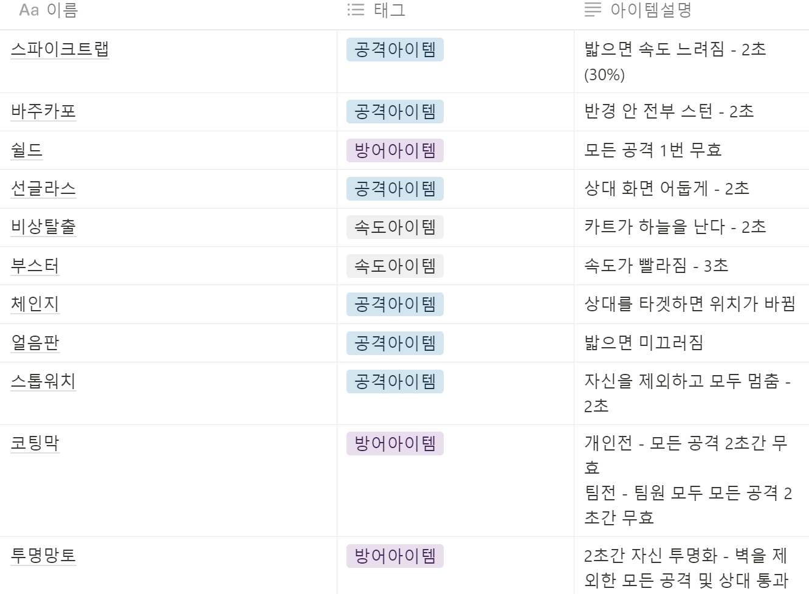

### 🎨 레벨 디자인

#### 해변 맵 (장애물 아이템 전)
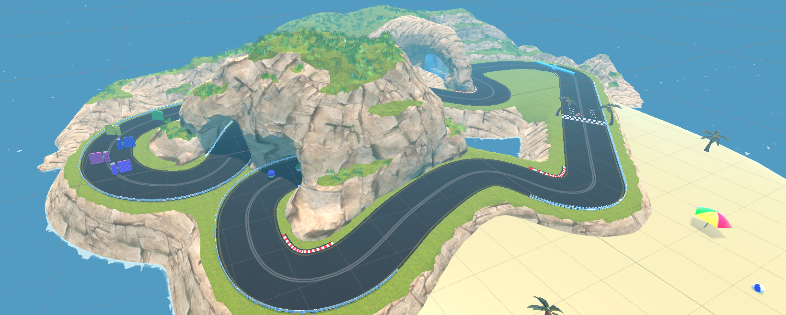

- 기본적인 트랙에 다양한 장애물과 아이템이 배치되어 있는 맵
- 가장 짧은 맵으로 튜토리얼 역할을 할 수도 있음

#### 오르막길 (장애물 아이템 전)
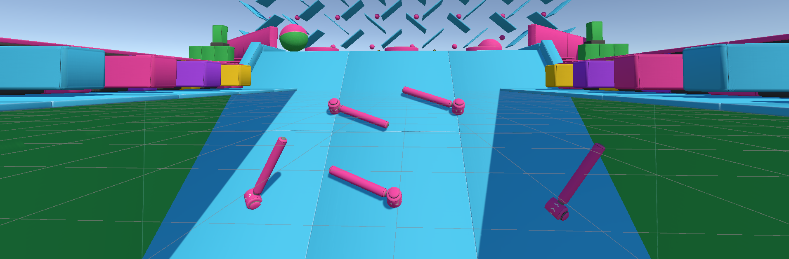

- 오르막을 올라가며 아이템을 먹어 방해를 할 수 있는 맵
- 오르막을 오르는 과정 중 떨어지는 공 방해물 등을 피해 골인 지점에 도착해야한다

#### 원형맵 (장애물 아이템 전)
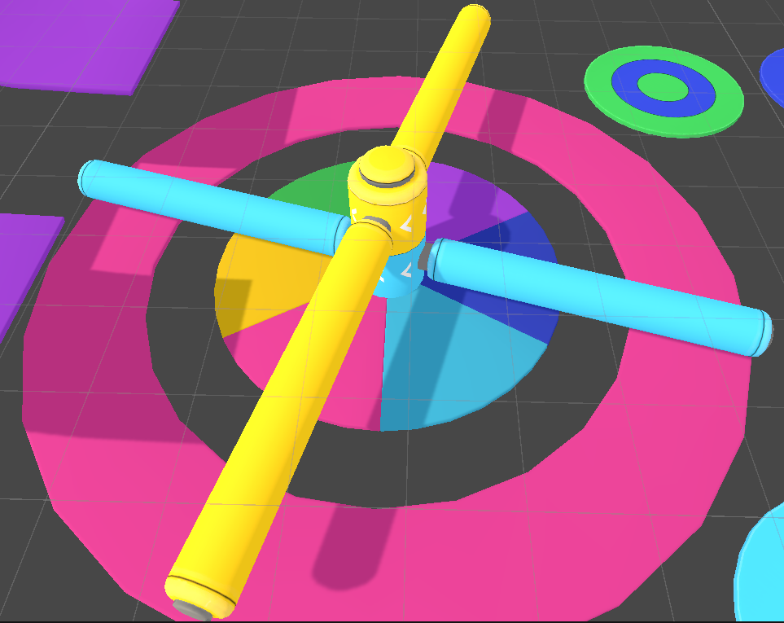

- 돌아가는 원통을 피해 최대한 살아남아 점수를 획득 해야 한다
- 적은 확률로 등장하는 아이템을 먹어 방해를 할 수 있다

#### 축구 경기장 (특별 모드)

- 축구 경기장에서 카트를 이용해 축구를 진행
- 상대편 골대에 공을 더 많이 넣는 것이 목표

#### 랜덤 문을 통과하라 (스피드 전)
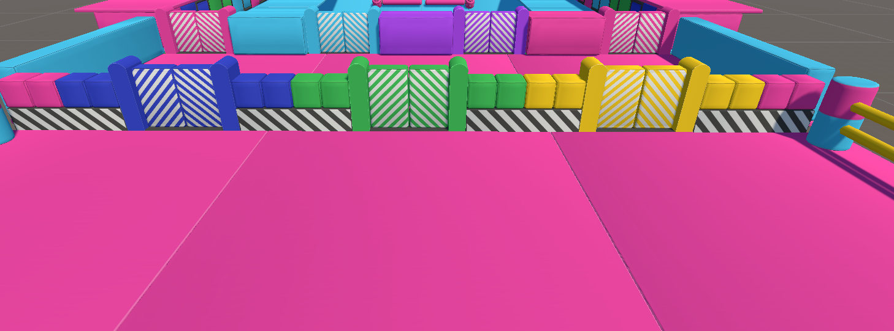

- 랜덤으로 뚫려 있는 문을 찾아 스피드전으로 레이싱을 하는 맵
- 트랙 자체는 단순한 형태로 어렵지 않은 1랩 맵이지만 운 요소가 크게 작용하는 맵

#### 스피드 발판 맵 (스피드 전)
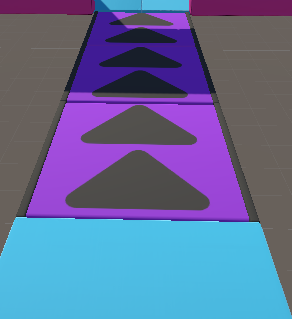

- 스피드 발판이 제일 많이 배치되어 있는 맵
- 가장 스피디함을 느낄 수 있는 맵

### 🎞 씬

#### 로그인
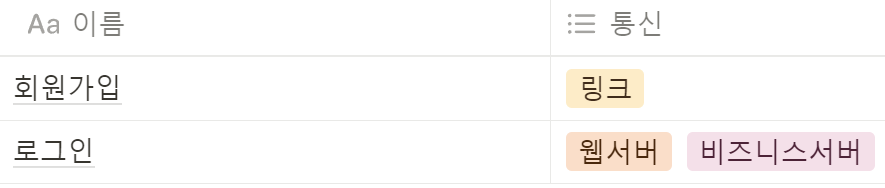

#### 로비
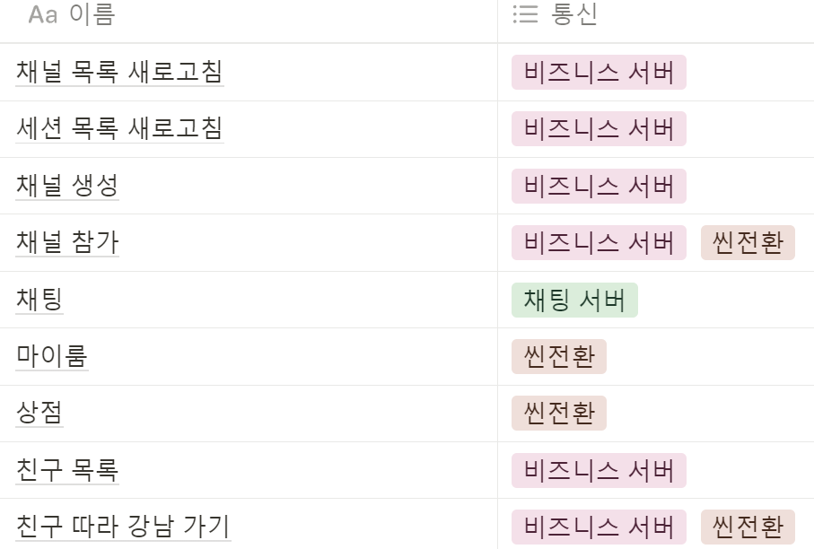

#### 마이룸
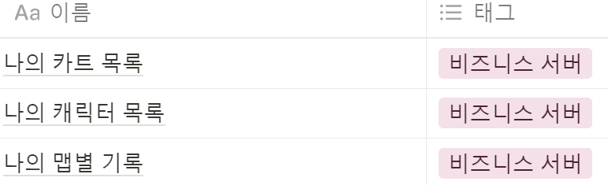

#### 상점
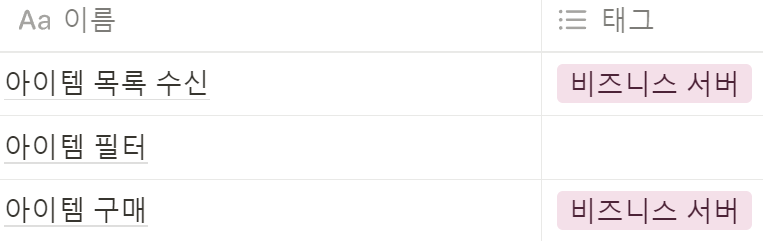

#### 채널
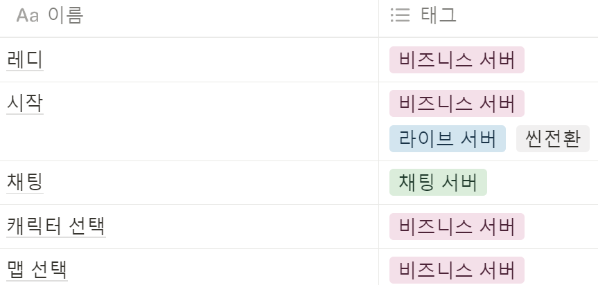

#### 게임
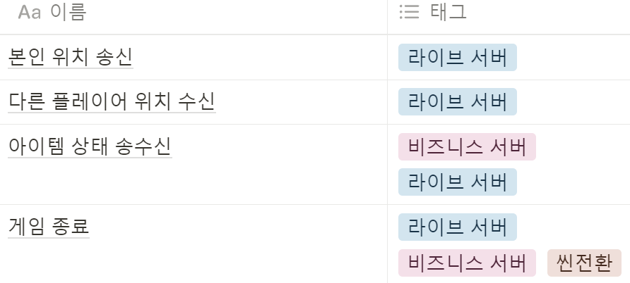

#### 결과
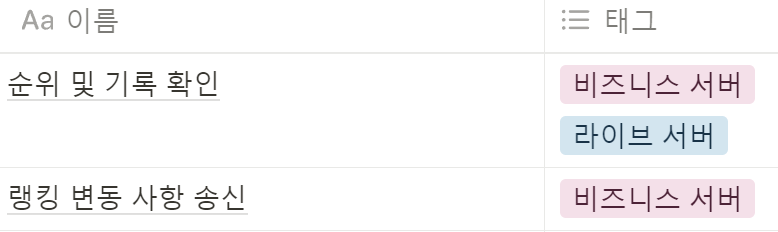

## 4️⃣ System Architecture
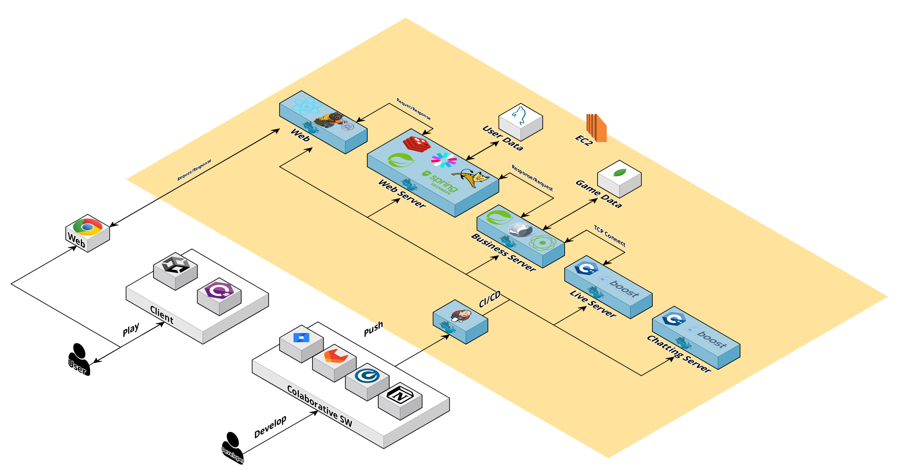

## 5️⃣ Convention
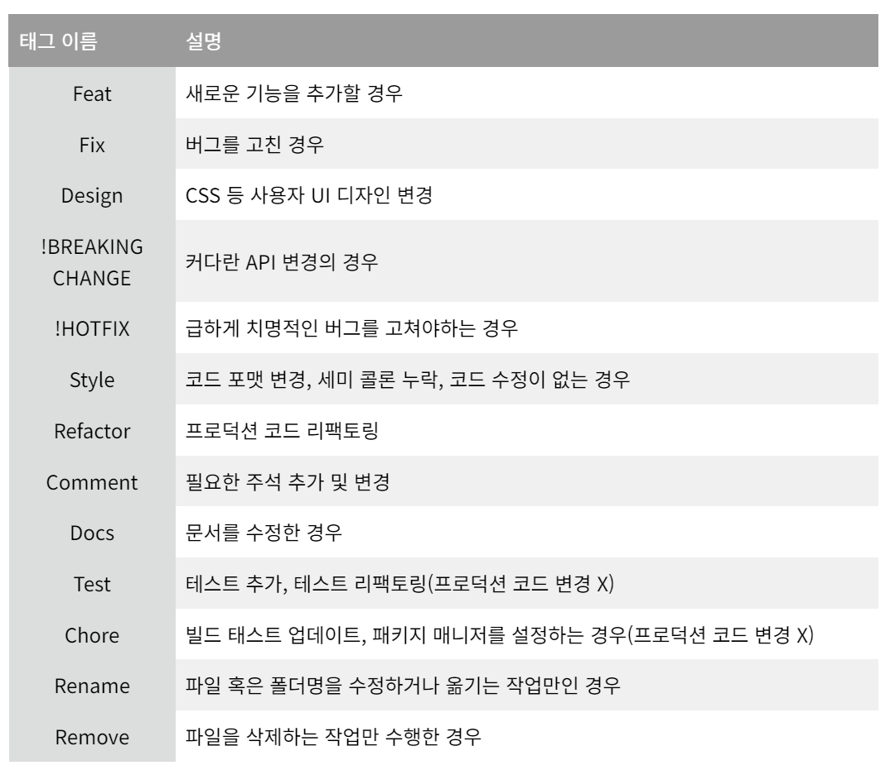

### 👩‍💻 브랜치 종류
- master: 최종 배포 브랜치
- develop: 다음 출시 버전을 개발하는 브랜치 (merge 대상 브랜치)
- test: CI/CD 및 기타 테스트용 브랜치

### 👨‍🔧 커밋 브랜치
- 개인 브랜치(영문 이름) -> Merge Request -> develop 브랜치 -> 개발완료 -> master 브랜치

### 👨‍👨‍👧‍👦 팀 커밋 컨벤션
- <타입>[적용범위]: <설명>
  - ex) ssafy브랜치에 Feat[Common]: README.md udpate
- 적용범위
  1. Common: 공통 작업
  2. Live: 라이브 서버
  3. Business: 비즈니스 서버
  4. Auth: 웹 및 인증 서버
  5. Chat: 채팅 서버
  6. Web: 웹 프론트엔드
  7. Unity: 유니티 